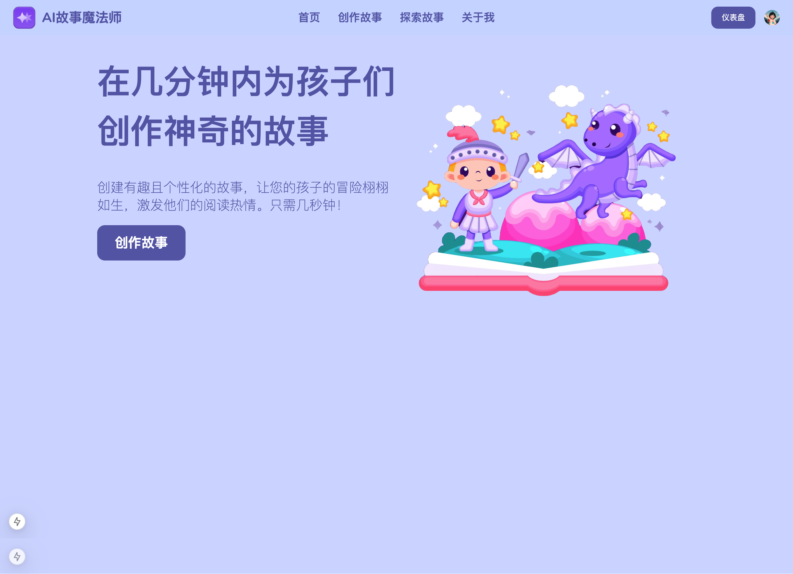

# AI 故事魔法师

**AI 故事魔法师** 是一款智能儿童故事生成 SaaS 产品，通过尖端的人工智能技术，为孩子和家庭带来独特的故事体验。无论是为孩子定制专属的冒险故事，还是为教育者提供寓教于乐的内容，AI 故事魔法师都能轻松满足需求，点燃孩子的想象力和创造力。



## ✨ 特性

- **故事定制**：基于主题、相似性、年龄段和图片风格，生成专属儿童故事。
- **响应式设计**：完美适配所有设备，无论是手机、平板还是桌面端，用户体验始终如一。
- **多样化输出**：支持文本故事生成与图片生成，增强互动性。
- **寓教于乐**：为教育者和家长提供创意丰富的内容。
- **友好的用户界面**：简单易用的界面，适合所有用户。
- **灵活支付**：支持 PayPal，满足多样化的订阅需求。

## 🛠 技术栈

- **主框架**: [React](https://reactjs.org/) + [Next.js](https://nextjs.org/) + [TypeScript](https://www.typescriptlang.org/)
- **样式**: [Tailwind CSS](https://tailwindcss.com/) + [NextUI](https://nextui.org/)
- **身份验证**: [Clerk](https://clerk.dev/)
- **数据库**: [Drizzle](https://orm.drizzle.team/)
- **存储**: [Firebase](https://firebase.google.com/)
- **支付系统**: [PayPal](https://www.paypal.com/)
- **AI 服务**:
  - **内容生成**: [Gemini API](https://www.google.com/search?q=Gemini+API)
  - **图片生成**: [Replicate](https://replicate.com/)
- **部署**: [GitHub](https://github.com/) + [Vercel](https://vercel.com/)
- **网站流量统计**: [Google Analytics](https://analytics.google.com/analytics/web/)

## 🚀 快速开始

按照以下步骤在本地启动 **AI 故事魔法师**：

### 1. 克隆仓库

```bash
git clone https://github.com/geallenboy/ai-story-wizard.git
cd ai-story-wizard
```

### 2. 安装依赖

确保已安装 Node.js 和 pnpm，然后运行：

```bash
pnpm install

```

### 3. 配置环境变量

在项目根目录下创建 .env 文件，并添加以下内容：

```

NEXT_PUBLIC_CLERK_FRONTEND_API=你的 Clerk Frontend API
NEXT_PUBLIC_FIREBASE_API_KEY=你的 Firebase API 密钥
NEXT_PUBLIC_REPLICATE_API_KEY=你的 Replicate API 密钥
NEXT_PUBLIC_PAYPAL_CLIENT_ID=你的 PayPal 客户端 ID

```

### 4. 启动开发服务器

确保已安装 Node.js 和 pnpm，然后运行：

```bash
pnpm dev

```

打开浏览器并访问 http://localhost:3000。

## 🌐 在线体验

访问 AI 故事魔法师 体验完整功能。

## 🤝 贡献

欢迎对 AI 故事魔法师 的发展做出贡献！请按照以下步骤提交您的代码：

Fork 此仓库。
创建您的分支：git checkout -b feature/新功能。
提交更改：git commit -m '添加新功能'。
推送到分支：git push origin feature/新功能。
提交 Pull Request。

## 📜 许可证

此项目基于 MIT License 开源。

## 💌 联系我

如果您有任何问题或建议，请通过以下方式联系我们：

Email: gejialun88@gmail.com </br>
wx: wxgegarron

感谢您使用 AI 故事魔法师，希望能为您的家庭和教育带来无尽的创意和乐趣！

##
